# Final Reports - MATH620152

Author: 吴羿 22210180064

[TOC]


## 总览

1. Notebook 程序文件结构：

   * `Task-1.ipynb` 包含 : 4 个类，18 个各类知识点汇总；

   * `Task-2.ipynb` 包含 : 2 个类及 `Seaborn` 绘图， 8 个各类知识点汇总；

   * `Task-3.ipynb` 包含 : 基于 Pytorch 实现的全连接神经网络，4 个各类知识点汇总；

   * `Task-4.ipynb` 包含 : 基于 gurobipy 实现的神经网络，2 个各类知识点汇总；

   * `R_stratup.R` 包含：基于 R 的初学者级的应用；

2. 分列的 `torchex_main.py` 以及 `AsData.py` 文件

   *  `AsData.py` 提供 Pytorch 的 `Dateset`定义模块
   *  `torchex_main.py` 方便命令行调用

3. 文件夹 doc 提供了由 **syphinx** 自动生成并建立的程序说明文档（仅限于 python）

4. 文件夹 `__pycache__` 是有 python 运行中生成的缓存文件夹，可以忽略；


## Task_1

### classTask_1.data_pd(path)

基于源数据`Data_structure_AHS.xlsx`

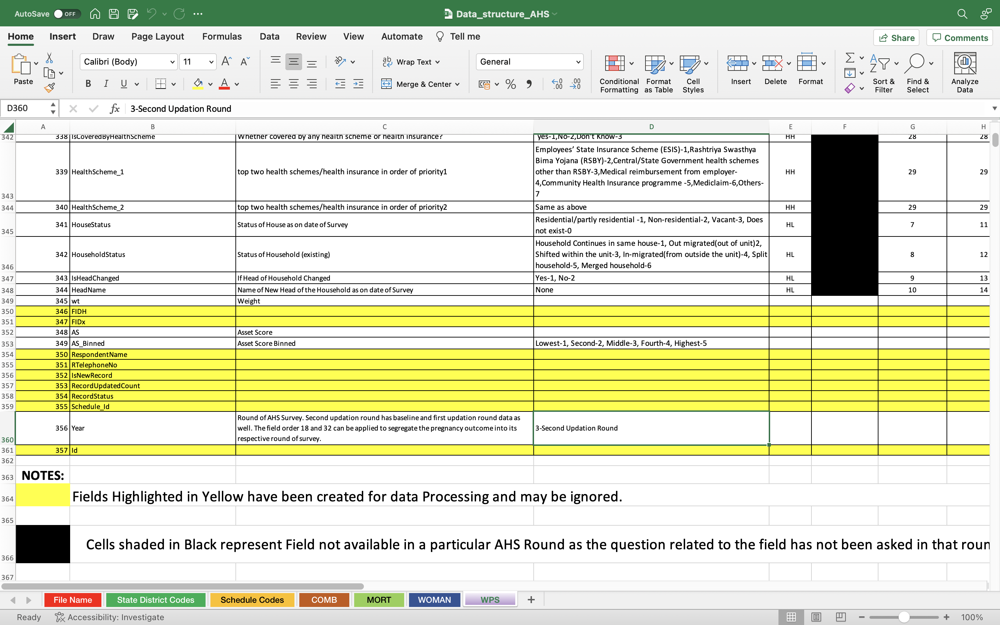

* 实现方法：

  1. 多表数据读入 , 多级索引结构导入
  2. 表的基础数据清洗 (NA处理、删除非必要数据)
  3. 数据按条件筛选 (`iloc` mask) : 处理原表中黄色和黑色的mask逻辑
  4. 数据框整合 (merge连接)
  5. 数据查询 , 输出保存和简单变形 (两种 `pivot`)

  ```python
  if __name__ == '__main__':            
      data = data_pd("./2022期末数据/Data_structure_AHS.xlsx")
      # 读取数据并作基础结构化调整
      data.read_data_all()
      # 清洗数据
      data.one_time_yellow()
      ret = data.black_na_ret('COMB')
      # 数据展示
      # data.show_data(data.data_all['COMB'])
      # 数据查询
      data.search_district(10,2)
      data.search_district(10,40) # not found
  
      # 数据合并
      df = data.merge_data("ABC") # 报错 Undefined dataframe!
      df = data.merge_data('WOMAN')
      # 输出基本表结构信息
      data.get_shape()
      # 数据保存
      data.output(df, './output/output',False)
  ```

  ```python
  ## 输出
  You are using pandas:1.4.2 and numpy:1.21.5
  Nice to see you! This project is designed as Pandas Class 1.
  There are 4 other sheets parsed in xlsx and they are:['COMB', 'MORT', 'WOMAN', 'WPS'].
  ============================================================
  There are 20 data can be ignored since they are marked yellow.
  There are 21 data can be ignored since they are marked yellow.
  There are 45 data can be ignored since they are marked yellow.
  There are 38 data can be ignored since they are marked black.
  ============================================================
  State Code 10 District Code 2 is PURBA CHAMPARAN.
  ============================================================
  ID not found!
  ============================================================
  Undefined dataframe!
  ============================================================
  Merge Succeed!
  ============================================================
  Sheet COMB's shape is (83, 7)
  Sheet MORT's shape is (104, 7)
  Sheet WOMAN's shape is (158, 7)
  Sheet WPS's shape is (324, 7)
  ```

* 附加：长宽表变形

  ```python
  df = df.fillna(method='ffill')
  df.pivot(index =["Field Name"],columns = ["Schedule Code"],values = ["First Updation"])
  df.pivot_table(index =["Field Name"],columns = ["Schedule Code"],
                 values = ["Description"], aggfunc = "count")
  ```


* 说明文档（部分）

  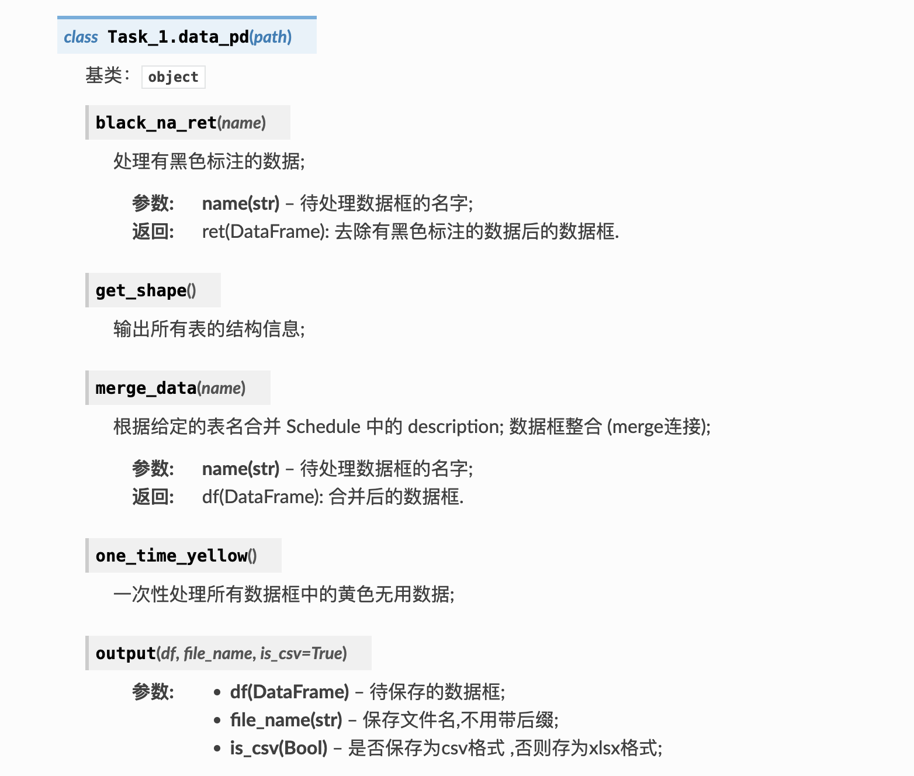


### classTask_1.data_cloud(path)

基于源数据 `小说.txt`

* 实现方法

  1. txt 文件读入 (中英文自动识别)
  2. jieba分词（在词处理过程中使用）
  3. 中英文基础词云图片展示
  4. 中英文mask-词云图片展示
  5. 中文使用过滤停词库的词云图展示

  ```python
  if __name__ == '__main__':
      data = data_cloud('./2022期末数据/小说.txt')
  
      # 展示英文文字前300个
      data.show_text()
  
      # 分别输出中英文词云图
      data.gen_wordcloud('english',n = -1,file_name = "./output/wcd1.png")
      data.gen_wordcloud('chinese',n = 20000,file_name = "./output/wcd2.png")
  
      # 输出中文有 mask 的词云图
      data.mask(type = 'chinese', n = 10000, file_name = "./output/wcd3.png")
  
      # 输出中文有 mask 的过滤停词库的词云图
      data.stop_words_mask(n = 10000, file_name = "./output/wcd4.png")
  ```

  ```python
  ## 输出
  You are using jieba:0.42.1.
  Nice to see you! This project is designed as WorldCloud Class.
  File Closed!
  ++++++++++++++++++++++++++++++++++++++++++++++++++++++++++++
  The Wolf and the Lamb WOLF, meeting  with a  Lamb astray  from the  fold, resolved  not to lay violent hands on him, but to find some plea  to justify to the Lamb the Wolf's right  to eat him.  He thus  addressed him: "Sirrah, last  year you grossly insulted  me." "Indeed," bleated the Lamb in a mou
  ++++++++++++++++++++++++++++++++++++++++++++++++++++++++++++
  The txt's length is 193374.
  Building prefix dict from the default dictionary ...
  Loading model from cache /var/folders/zz/c_1__h650c74spfy3w9n5_4r0000gn/T/jieba.cache
  Loading model cost 0.495 seconds.
  Prefix dict has been built successfully.
  ```

* 说明文档（部分）

  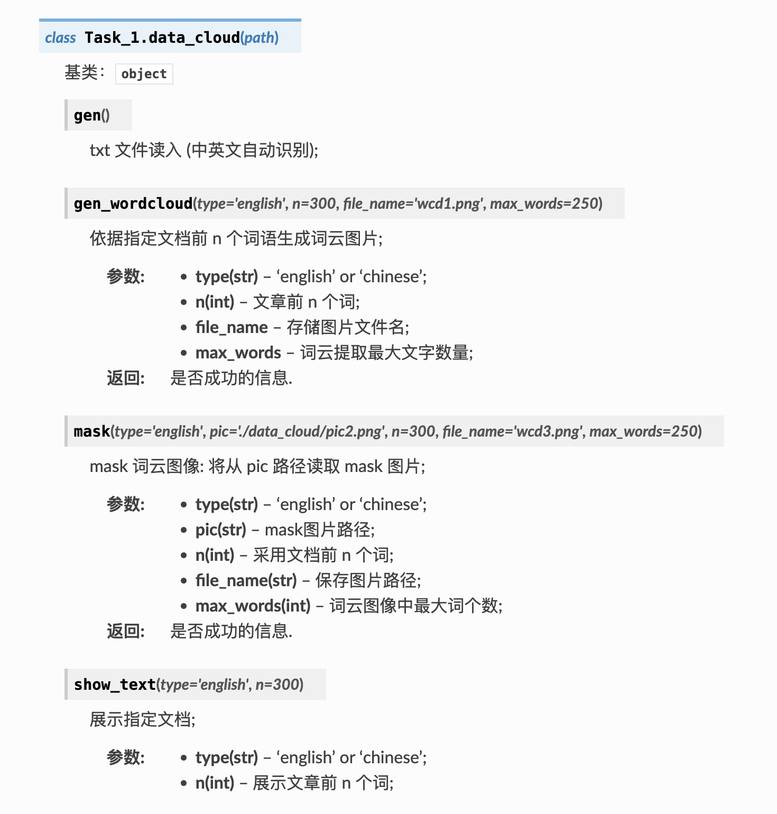


### classTask_1.data_learn(path)

基于源数据  `NMDS_coordinates.csv`

* 实现方法

  1. 用formual (`str`)形式获取测试、训练数据
  2. 贝叶斯岭回归以及ARD回归
  3. 贝叶斯岭回归结果的 `seaborn` 图示
  4. kMeans方法及预测
  5. DBSCAN方法及预测
  6. 支持向量机（SVC）方法及预测
  7. 支持超参的网格搜索方式

  ```python
  if __name__ == '__main__':
      data = data_learn('./2022期末数据/NMDS_coordinates.csv')
  
      # 获取bayes回归模型
      model_bayes = data.bayes_ridge_re('NMDS1~X_Vel',test_ratio = 0.1)
      # 获取测试集数据
      _,_,X_test,y_test = data.gen_data('NMDS1~X_Vel',ratio = 0.1)
      # 可视化
      bayes_plot(model_bayes,X_test,y_test,file_name="./output/output_fig.png")
  
      # 获取Kmeans模型
      model_kmean = data.cluster_model(formula = 'mean_rug+sd_rug',
                                       type = 'kmean' ,n_cluster=3)
      print(f"Predict class for ([14.1234,1.2666]) is 
            {model_kmean.predict([[14.1234,1.2666]])}") # 使用模型进行预测
  
      # 获取DBSCN模型
      model_dbscan = data.cluster_model(formula = 'mean_rug+sd_rug',
                                        type = 'DBSCAN' ,eps=0.1)
      print(f"DBSCAN predict {np.unique(model_dbscan.labels_)} classes.")
  
      # 获取SVC模型并且进行归一化处理
      model_svc = data.svm_svc('SEASON~X_Vel+MidPt',kernal='rbf'
                               ,test_ratio = 0.1,is_scale= True)
      # 获取测试集数据
      _,_,X_test,y_test = data.gen_data('SEASON~X_Vel+MidPt',
                                        ratio = 0.1,is_scale= True)
      y_pred = model_svc.predict(X_test)
  
      # 搜索上一个模型的最优超参
      param_grid = dict(gamma = np.logspace(-2,1,2), coef0 = np.logspace(0,5,10))
      _ = data.search_hyper_para(model_svc,param_grid,n_split = 10)
  ```

  ```python
  ## 输出
  You are using sklearn:1.0.2.
  Nice to see you! This project is designed as Sklearn Class.
  Notice: This is unsupervised learning since y is omitted!
  Kmeans Score is -2749.8407722635643
  Predict class for ([14.1234,1.2666]) is [1]
  Notice: This is unsupervised learning since y is omitted!
  DBSCAN predict [ 0  1  2  3  4  5  6  7  8  9 10 11 12 13 14 15 16 17 18 19 20 21 22 23
   24] classes.
  Self predict score is 0.5168667810177244
  Notice: Please establish the model first!
  The best parametes are {'coef0': 1.0, 'gamma': 10.0} with a score of 0.5610169491525424
  ```

* 说明文档（部分）

  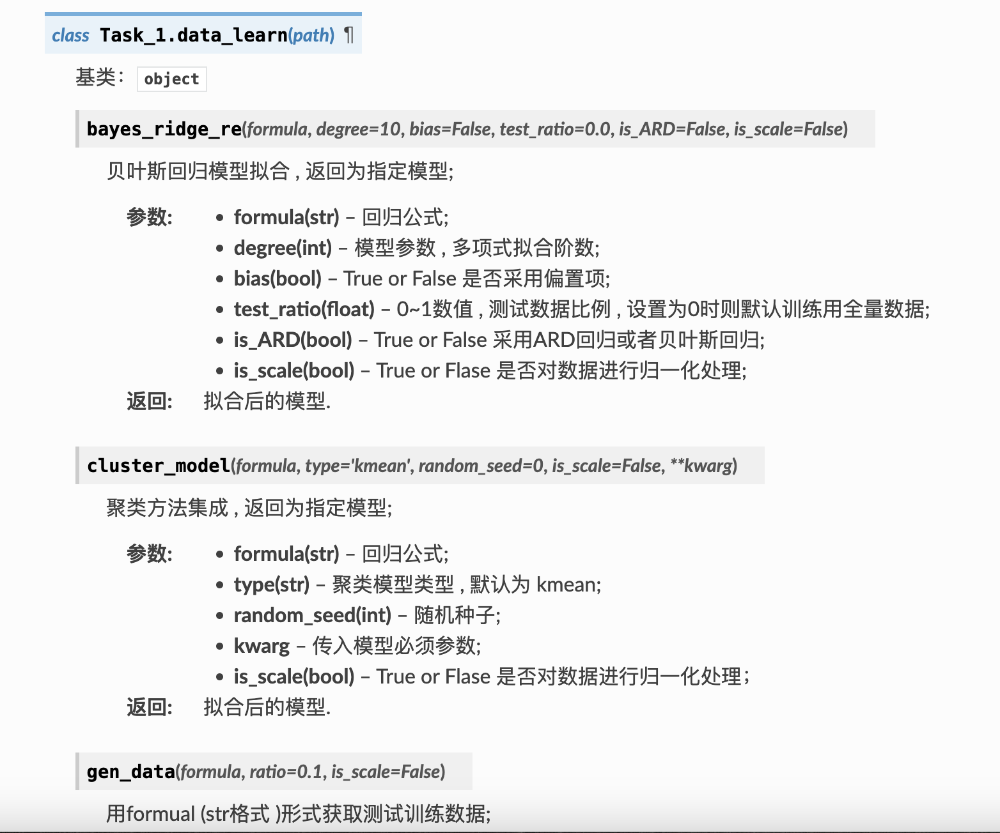


### classTask_1.WebSchedules(name, web)

* 实现方法

  1. 请求 Chrome 浏览器发布页面并解析

  ```python
  if __name__ == '__main__':
      now = datetime.datetime.now()
      headers = {...}
      # Chrome schedule
      chrome_schedules = WebSchedules('chrome_schedules','chrome')
      chrome_stable_release = WebSchedules('chrome_stable_release','chrome')
      response = requests.get(url_chrome_schedule_API, headers=headers)
      if response.status_code == 200:
          chrome_schedule = response.json()
          for item in chrome_schedule['items']:
              if 'Warning: avoid committing large changes,' not in item['summary']:
                  chrome_schedules.getschedules(item)
                  if re.match('M.* Stable Release', item['summary'], re.I):    
                      chrome_stable_release.getschedules(item)
  
          chrome_schedules.processtschedules(isprint = False, isunique= False)
          chrome_schedules.updateschedules_stored()
                   
          # Get stable release + stable cut + 1st beta info. 
          chrome_stable_release.processtschedules(isprint = True, isunique= False)
          # stable release
          print("----------")
          check_date = pd.to_datetime(datetime.date(2023, 10, 31))
          chrome_stable_release.updateschdeules(checkdate= check_date)
  ```

  ```python
  ## 输出
  Hi~Yi. This class is designed for getting chrome-version schedule!
  You are using requests:2.27.1.
   2022-12-03 20:09:33.839277 
  UPDATE: 
  CHROME SCHEDULE:
                             version
  date                              
  ...
  2023-10-03  M118 Stable Release
  2023-10-31  M119 Stable Release
  ----------
  CHROME M119 Stable Release RELEASED TODAY! 
  ```

* 说明文档

  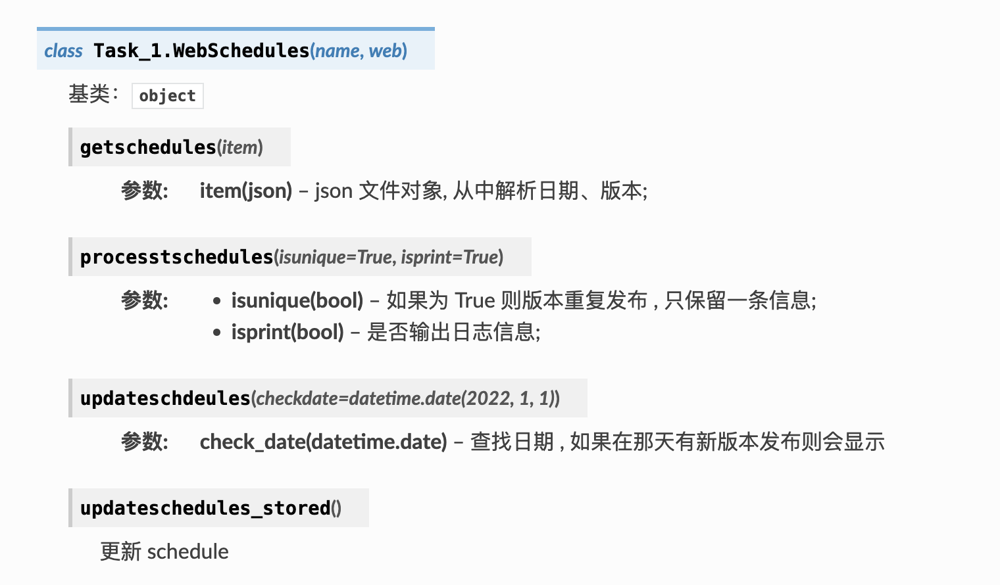


## Task_2

### classTask_2.elastic(path)

基于源数据 `confirmes.csv`

* 实现方法

  1. 弹性网络模型拟合及预测
  2. 多任务弹性网络模型拟合及预测

  ```python
  if __name__ == '__main__':
      data = elastic("./2022期末数据/confirmes.csv")
  
      # 弹性网络模型拟合
      params = {"alpha":1.0, "l1_ratio":0.5, "fit_intercept":True, 
                "precompute":False, "max_iter":1000, "copy_X":True, 
                "tol":1e-4, "warm_start":False, "positive":False, \
                "selection":"cyclic"}
      model = data.elsastic_net(target = ['contact'],x = ['mort','gueri'], 
                                params=params, test_ratio=0.3)
      print(f"Predict value when ['mort','gueri'] = [250,10000]:
            {model.predict([[250,10000]])}")
  
      # 多任务弹性网络模型拟合
      params = {"alpha":1.0, "l1_ratio":0.5, "fit_intercept":True, 
                "max_iter":1000, "copy_X":True, "tol":1e-4, "warm_start":False, 
                "random_state":False, "selection":"cyclic"}
      model_m = data.multi_elsastic_net(target = ['cas','contact'],
                                        x = ['communautaire','mort','gueri'], 
                                        params=params, test_ratio=0.3)
      print(f"Predict values when ['communautaire','mort','gueri'] = [4,250,10000]:
            {model_m.predict([[4,250,10000]])}")
  
  ```

  ```python
  ## 输出
  You are using sklearn:1.0.2.
  Nice to see you! This project is designed as Sklearn Class 2.
  ++++++++++++++++++++++++++++++++++++++++++++++++++++++++++++
  You are using n_samples: 235 and n_features: 2 to train!
  Hyper parameters: ['alpha', 'l1_ratio', 'fit_intercept', 'precompute', 'max_iter', 'copy_X', 'tol', 'warm_start', 'positive', 'selection']
  ++++++++++++++++++++++++++++++++++++++++++++++++++++++++++++
  Score on test set is 0.021467686178646694
  Predict value when ['mort','gueri'] = [250,10000]:[32.82221635]
  ++++++++++++++++++++++++++++++++++++++++++++++++++++++++++++
  You are using n_samples: 235 and n_features: 3 to train!
  Hyper parameters: ['alpha', 'l1_ratio', 'fit_intercept', 'max_iter', 'copy_X', 'tol', 'warm_start', 'random_state', 'selection']
  ++++++++++++++++++++++++++++++++++++++++++++++++++++++++++++
  Score on test set is 0.35604579430190353
  Predict values when ['communautaire','mort','gueri'] = [4,250,10000]:[[27.59085898 20.3436984 ]]
  ```

* 说明文档

  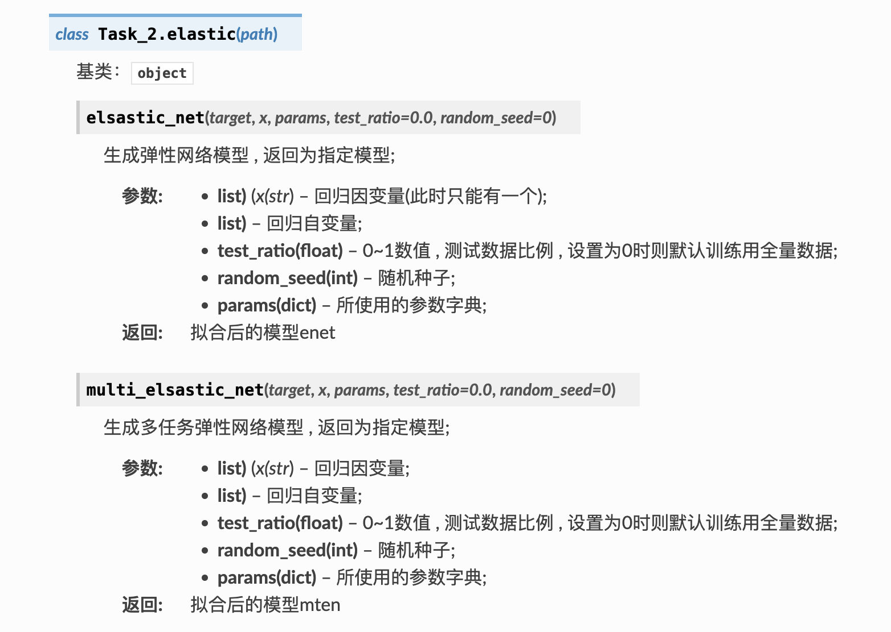

### classTask_2.Linear()

基于源数据 `zone_c_confirmesGeo.csv`

* 实现方法

  1. 支持多元线性回归模型的拟合（区间估计）
  2. 支持各种拟合优度数据的输出：AIC, BIC, R2, F统计量等
  3. 支持预测（区间估计）
  4. 支持带有线性约束条件的回归
  5. `statsmodels` 库 `api` 的实现和比较

  注意：
  1. 输出中的 Rc 就是 R-squared
  2. 在小样本下，区间估计会稍有出入，因为采用的是正态分布分位数而非精确T分布
  3. 本实例仅依靠 `numpy` 进行矩阵向量算法
  4. 实际上，本实例也实现了 Ridge 岭回归 , 但 `statsmodels` 库并没有直接的实现方式

  ```python
  file = pd.read_csv("./2022期末数据/zone_c_confirmesGeo.csv")
  X, y = np.array(file['lat']), np.array(file['lon'])
  X = sm.add_constant(X)
  reg_learn = Linear(y,2,X)
  reg_learn.fit()
  ```

  ```python
  ## 输出
  OLS Progressing...
  OLS Regression Results
  ============================================================
  const = -5.511065436104366 , [0.025 0.975]:[-11.171965634004241,0.1498347617955087]
  t test = -1.908122008363944
  x_1 = -0.7714117686812897 , [0.025 0.975]:[-1.1584240710853375,-0.3843994662772418]
  t test = -3.9067674521540314
  ============================================================
  Ruc = 0.9899007999359839
  Rc = 0.07621400226135157
  F-statistic = 15.2628319252101
  Log-Likelihood = -364.1299342197638
  AIC = 732.2598684395276
  BIC = 738.7220856732368
  ============================================================
  matrix([[-5.51106544],
          [-0.77141177]])
  ```

* 说明文档

  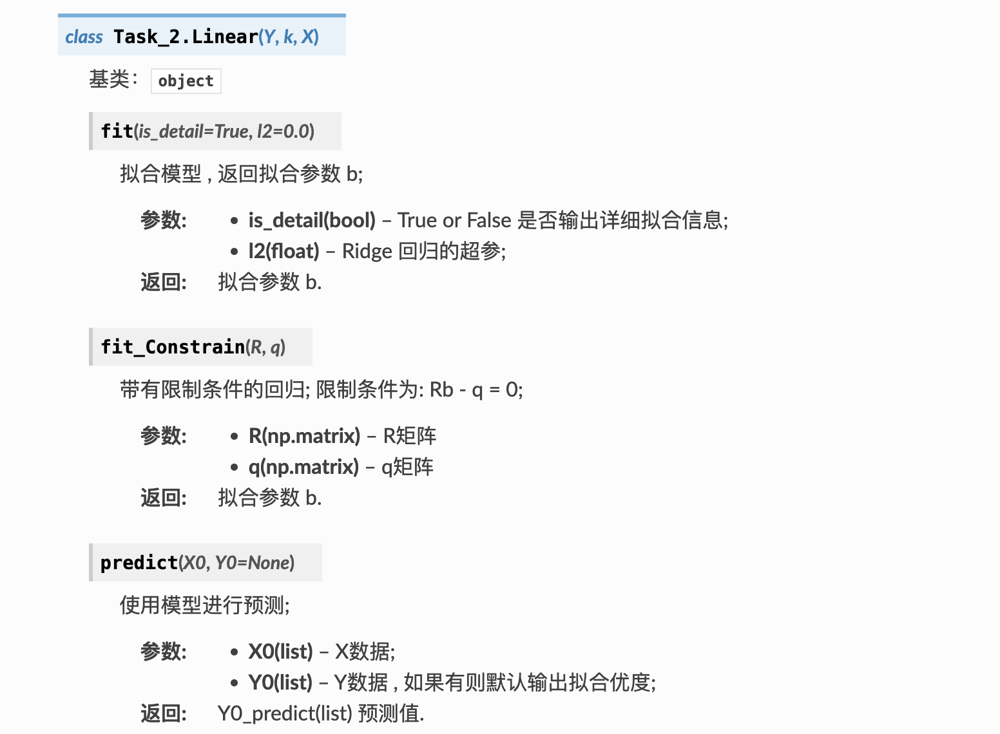


### Seaborn

* 实现各种数据分布可视化

* 基于源数据

  ```python
  file = pd.read_csv("./2022期末数据/regions_cas.csv")
  
  # 添加分类数据
  file["kind"] = 59 * ["a"] + 59 * ["b"] + 61 * ["c"]
  file["type_1"] = 100 * ["T"] + 79 * ["F"]
  file = file.iloc[np.random.permutation(len(file))] # 随机打乱
  file["type_2"] = 100 * ["F"] + 79 * ["T"]
  ```


* 使用举例：

  ```
  sns.heatmap(data = file[file.columns[3:9]].corr(), cmap = 'flare')  
  ```

  

  ```python
  sns.displot(data = file,x="MATAM",row="type_1",
              							col="type_2",hue="kind",kde = True)
  ```

  

  ```python
  g = sns.JointGrid(data = file, x = "DIOURBEL", y = "SÉDHIOU",hue = 'type_2')
  g.plot_joint(sns.scatterplot, s = 80, alpha =.4) # 点的大小和透明度
  g.plot_marginals(sns.histplot, kde=True)
  ```

  


## Task_3

### Pytorh 实例

* 基于源数据：`NMDS_coordinates.csv`

* 实现：

  1. `Dataset` 自定义 ，(实现在 `AsData.py` 中，需要在这里import）

  2. 全连接神经网络 `Net()` 类 (继承自 `nn.Module`)

  3. 网络训练和测试

  4. 使用 `argparse` 提供自定义参数设计并提供保存模型端口等

* Torch 环境：

  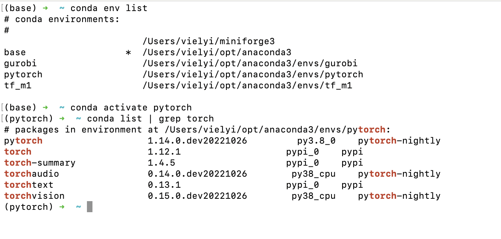

* 程序使用：

  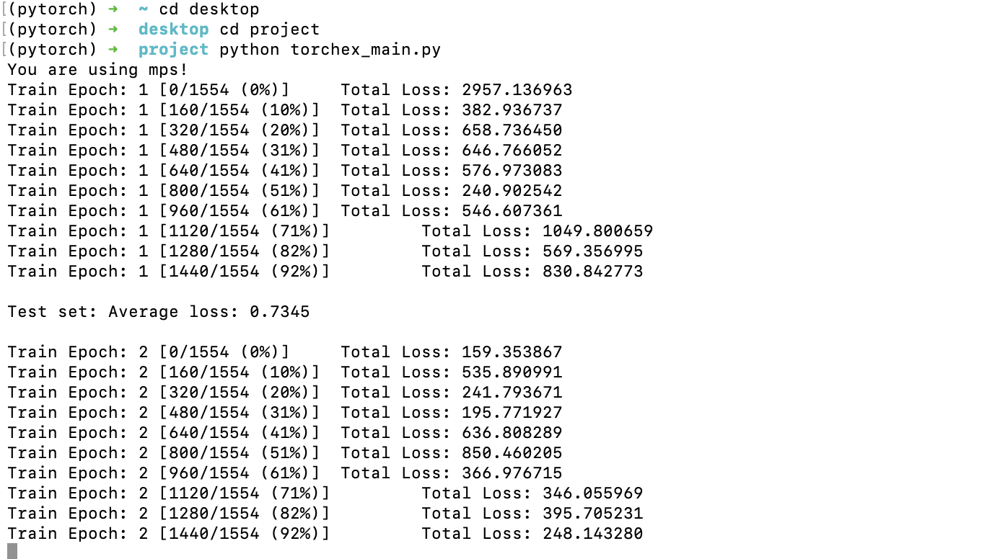

* 输出结果：

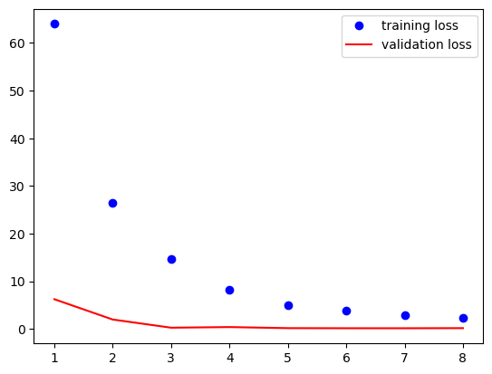


* 其他可获取参数

  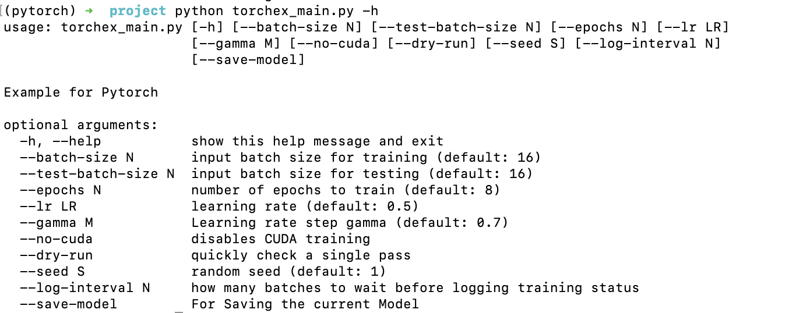


## Task_4

### Python最优化算法

1. 入门级实例 : 线性规划问题实例(及非线性约束)

2. 更多约束 : TSP问题求解

* 基于数据源

  ```python
  data = pd.read_csv("./2022期末数据/11 (1).tsv" , sep = "\t")
  ```

* 举例：

  ```python
  # 配置模型
  model = gurobipy.Model("Model 2")
  
  # 定义自变量
  tpm = model.addVar(lb=0.0, ub = gurobipy.GRB.INFINITY, vtype=gurobipy.GRB.CONTINUOUS, name = "tpm")
  tmm = model.addVar(lb=0.0, ub = gurobipy.GRB.INFINITY, vtype=gurobipy.GRB.CONTINUOUS, name = "tmm")
  
  # 设置目标函数
  model.setObjective(20 * tpm + 10 * tmm, gurobipy.GRB.MAXIMIZE) # 最大化
  # 设置非线性约束
  for i in range(5):
      model.addConstr(float(data.iloc[i][['tpm']].values) * tpm**2 
                      + float(data.iloc[i][['tmm']].values) * tmm**2<= 100)
      # f非线性约束中必须是整数幂 , float 类型会报错
      model.addConstr(float(data.iloc[i+5][['tpm']].values) * tpm 
                      + float(data.iloc[i+5][['tmm']].values) * tmm >= 1)
  model.update()
  
  # 显示求解过程（套路代码）
  model.Params.LogToConsole = True
  # 开始优化求解
  ```

  ```python
  ## 输出
  Gurobi Optimizer version 9.5.2 build v9.5.2rc0 (mac64[rosetta2])
  Thread count: 8 physical cores, 8 logical processors, using up to 8 threads
  Optimize a model with 5 rows, 2 columns and 10 nonzeros
  Model fingerprint: 0xe06fe8d1
  Model has 5 quadratic constraints
  Coefficient statistics:
    Matrix range     [1e-02, 6e-01]
    QMatrix range    [3e-02, 2e-01]
    Objective range  [1e+01, 2e+01]
    Bounds range     [0e+00, 0e+00]
    RHS range        [1e+00, 1e+00]
    QRHS range       [1e+02, 1e+02]
  Presolve time: 0.00s
  Presolved: 20 rows, 15 columns, 33 nonzeros
  Presolved model has 5 second-order cone constraints
  Ordering time: 0.00s
  
  Barrier statistics:
   Dense cols : 1
   AA' NZ     : 1.080e+02
   Factor NZ  : 2.120e+02
   Factor Ops : 2.874e+03 (less than 1 second per iteration)
   Threads    : 1
  
                    Objective                Residual
  ...
  
  Barrier solved model in 7 iterations and 0.02 seconds (0.00 work units)
  Optimal objective 5.95073794e+02
  ```

  ```python
  print(f"optimal objective value is {model.objVal}.")
  # 查看变量取值
  for v in model.getVars():
      print('%s %g' % (v.varName, v.x))
  ```

  ```python
  ## 输出
  optimal objective value is 595.0737937549338.
  tpm 14.3987
  tmm 30.71
  ```

* TSP 问题

  ```python
  model = gurobipy.Model('TSP')
  
  x = model.addVars(city_num, city_num, vtype = gurobipy.GRB.BINARY, name = 'x')
  utility = model.addVars(city_num, lb = 0, 
                          vtype = gurobipy.GRB.CONTINUOUS, name = 'utility')
  
  model.setObjective(sum(x[i,j] * distance[i,j] 
                         for i in range(city_num) for j 
                         in range(city_num)), GRB.MINIMIZE)
  
  # 设置约束
  for j in range(city_num):    
      model.addConstr(gurobipy.quicksum(x[i,j] for i in range(city_num)) == 1)
  for i in range(city_num):
      for j in range(1, city_num):
          if (i != j):
              model.addConstr(utility[i] - utility[j] 
                              + city_num * x[i,j] <= city_num - 1)
  model.update()
  
  # 显示求解过程
  model.Params.LogToConsole = True
  # 限制求解时间
  model.Params.TimeLimit =50
  # 开始优化求解
  model.optimize()
  
  print(f"optimal objective value is {model.objVal}.")
  
  # 将结果输出成路径
  u_value = []
  for i in range(city_num):
      u_value.append(utility[i].x) # 加载 utility[i] 的值
  sequence = sorted(enumerate(u_value), key = lambda y:y[1]) # 按照 utility 值排序
  for item in sequence:
      print(item[0] + 1,'->',end=' ')
  print(1)
  ```

  ```python
  optimal objective value is 1.136092581758076.
  1 -> 5 -> 26 -> 7 -> 30 -> 25 -> 28 -> 29 -> 2 -> 22 -> 3 -> 4 -> 6 -> 21 -> 23 -> 27 -> 12 -> 24 -> 11 -> 13 -> 14 -> 8 -> 9 -> 10 -> 20 -> 16 -> 17 -> 15 -> 18 -> 19 -> 1
  ```

  

## R_startup

主要内容：

* 主成分分析
* 支持向量机的应用和自动调参设计
* R 神经网络的应用和结果评估
* 决策树生成和绘图
* 广义线性回归应用
* R集成学习：梯度提升树
* 基本作图：包括柱状图、箱形图、饼状图等
* 偏最小二乘回归PLS和主成分回归PCR