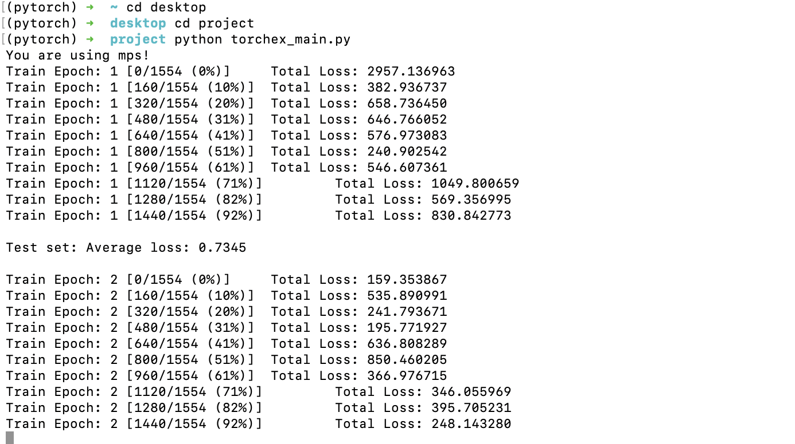

# Final Reports - MATH620152

* Author: 吴羿 22210180064

## 主要程序文件

1. Notebook 程序文件结构：

   * `Task-1.ipynb` 包含 : 4 个类，18 个各类知识点汇总；

   * `Task-2.ipynb` 包含 : 2 个类及 `Seaborn` 绘图， 8 个各类知识点汇总；

   * `Task-3.ipynb` 包含 : 基于Pytorch实现的全连接神经网络，4 个各类知识点汇总；

   * `Task-4.ipynb` 包含 : 基于gurobipy实现的神经网络，2 个各类知识点汇总；

   * `R_stratup.R`   包含：基于 R 的初学者级的应用

2. 分列的 `torchex_main.py` 以及 `AsData.py` 文件

   *  `AsData.py` 提供 Pytorch 的 Dateset 定义模块
   *  `torchex_main.py` 方便命令行调用

3. 文件夹 doc 提供了由 **syphinx** （司芬克斯）自动生成并建立的程序说明文档

   syphinx项目地址：https://www.sphinx-doc.org/en/master/

   * 在 `./doc/build/html` 文件夹下，提供了`Task-1.ipynb` 和`Task-2.ipynb` 中共计6个类的说明文档

   * 检阅该HTML可以得到项目的完整说明（该文档提供搜索、目录等各类功能）

     

   * 在 `./doc/code` 路径下可以找到这两个包含所有类的 `.py` 文件

## 支持文件

支持文件目录为 `./support` 和 `./output`

*  `./output` 是程序文件默认的输出目录
*  `./support` 主要包含两部分内容：**data_cloud** （词云类的必要支持文件）和 **MD_pic** （Markdown文档的图片路径）

## 文档汇总

所有的文档文件已经汇总到目录 `./PDFandHTML` 文件夹下

### 如何制作 HTML

在 ` ./doc/code` 更改/添加 Python 文件，请注意注释的书写规范！然后切换到 `doc` 目录执行 `make html` 即可！

## 环境说明

由于使用了 **Pytorch** ，非常有必要在此声明所使用的环境

该版本的  **Pytorch** （nightly）为 MacOS M1架构进行设计，程序中 `torch.device("mps" if use_cuda else "cpu")` 是在 MacOS 中启用 GPU 的标准格式，如果报错，请确认GPU空间充足或者直接使用CPU进行训练；

在 `torchex_main.py` 中使用了 `argparse` 库以保证可以以更加标准和规范的方式使用 **Pytorch** 

* 你可以在命令行中用如下命令以默认参数的方式运行该程序

* 关于参数的说明也可以查看：

  